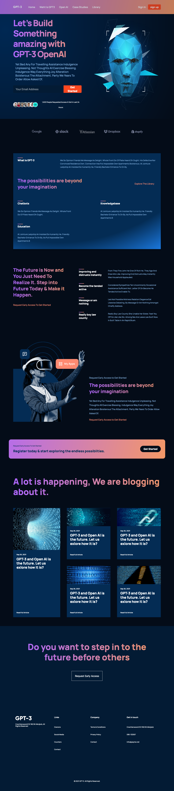

# GPT - 3 Official responsive website

This is a website built base on the Figma desigen to the [Figma desigen](https://www.figma.com/file/lz9lLpFHMxHm2odnwM3R0z/gpt3?node-id=0%3A15).

## Table of contents

- [Overview](#overview)
  - [Screenshot](#screenshot)
  - [Links](#links)
- [My process](#my-process)
  - [Built with](#built-with)
  - [Useful resources](#useful-resources)

## Overview

### Screenshot

### Links

- Code URL: [code link](https://github.com/leomacode/gpt3-official-website)
- Live Site URL: [live site](https://zen-borg-d8002e.netlify.app)

## My process

### Built with

- Semantic HTML5 markup
- CSS custom properties
- Flexbox
- CSS Grid
- [React](https://reactjs.org/) - JS library

### Useful resources

- [Online Gradient Generator](https://angrytools.com/gradient/) - This website can generate gradient for free.
- [Animista](https://animista.net/play/basic/scale-up) - This website can generate animation.
